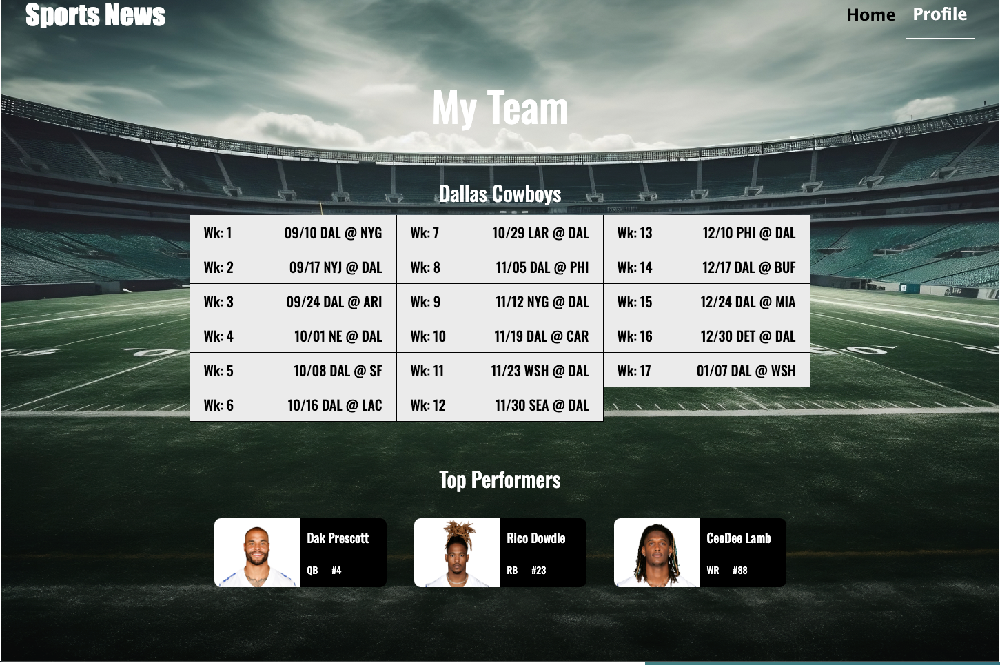

# Sports News App

### Overview

- Intro
- Project Features
- Images

**Intro**

This is the frontend for an app designed to provide the user with data, schedule and top players, on an nfl team they choose to follow. The app will also provide some recent NFL news. Originally the app was going to be just an nfl news app but I decided to implement team specific data, and just kept the name. When the user picks a team they want to follow, team schedule and player data will be loaded on to the profile page.

**Project features**

- React
- Javascript
- CSS
- HTML 5
- Responsive Web Design
- Forms

**Images**

**Info**
N/A

**Accessing Application**
N/A

<!-- domain name: https: -->
